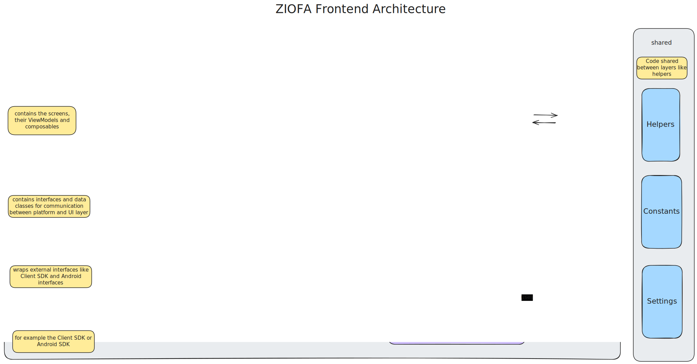

<!--
SPDX-FileCopyrightText: 2025 Luca Bretting <luca.bretting@fau.de>

SPDX-License-Identifier: MIT
-->

# Frontend Architecture

## Motivation
The purpose of the frontend is to provide a **on-device** configuration and visualization interface for 
the ZIOFA backend.  
In situations where there is no external device
available for configuring, receiving and visualizing the data, the user should still be able to
analyze the behavior of components on the device in real-time.

## Target Audience
The target audience for the frontend is developers of Android apps and integrators of Android devices
that want to observe the behavior of their own / other apps on the device without instrumenting the
apps themselves and without requiring external analysis tools for communication with the backend.

## Requirements
The requirements for the frontend can be found in the requirements doc under <Repo Root>/Documentation.

## Constraints
* Due to limited hardware resources and the need for non-interference with the behavior of other applications,
the frontend should be as resource-efficient as possible. The current implementation is not resource-efficient
enough to be used in production environments, but there are ideas for improving the resource usage, which will
be discussed later.
* Additionally, while the frontend itself can be run as a non-system app, the backend must always be running
in the background as root, meaning the application cannot be used without root access to the device.
  (for frontend developers only: the mocked Client SDK can be used without root access)
* For some features, like the overlay mode, the frontend requires runtime permissions that are non-requestable
on some devices due to missing settings menus. This means that the permissions must either be granted via
ADB or the integrator must ensure that the app will be granted the permissions by pre-granting them.
For information on how to grant permissions, see the README.

## The Client SDK
The frontend built along with a Client SDK that could be used by other applications as well.
This Client SDK allows for easy communication with the backend for settings configuration or receiving
events from the backend.
The Client SDK is written in Kotlin and is a wrapper around the Rust Client SDK, interoperating with which
is done via the UNIFFI bindings generator.
This architecture allows, for example, swapping out communication protocols without touching the frontend code.
The Client SDK could for example also directly implemnent a gRPC connection to the backend instead of
using the Rust Client SDK which currently handles gRPC communication.
There is also a mocked flavor of the Client SDK / App that can be used easy testing and development.

## High level app architecture
An overview of the high level architecture of the app can be found in the following diagram.

## Runtime view
The following scenario describes the standard use case:
- The user starts the app
- Upon startup, the app performs a sanity check of the backend.
  - If an error occurs the error is shown to the user.
  - While the sanity check is running, the app shows a loading screen.
  - Upon completion, the app transitions to the main menu.
- The user navigates to the configuration menu
  - The app starts polling the process list from the backend.
  - The found processes are combined with data from PackageManager to display icons, app names and
  process names.
- The user can select a process to configure the backend for.
- The user selects activates or deactivates backend features for the selected process.
  - Upon completing the selection, the user submits the configuration and it is sent to the backend
  - The backend sets and persists the configuration.
  - If an error occurs, the error is shown to the user.
  - Otherwise, the backend starts collecting data for the set configuration.
- The user navigates back to the home screen and then to the visualization screen.
  - App polls the backend for info on running processes and combines this information with the
  backend configuration applied by the user to display the configured options.
  - The user selects a process, metric and timeframe to visualize.
  - The app subscribes to the events from the backend starts aggregating the data. 
  - The aggregation is defined per metric and timeframe
  - The app display the visualization to the user, either as a chart or as an event list.
- The user can select the overlay mode on the visualization screen to launch the overlay.
  - Upon enabling the overlay a seperate background service is started that starts the overlay 
  window and manages its data. The service is stopped again via the app.

## Future work

### Resource usage
* Aggregation of events should optimally happen in the backend. This would reduce the amount of 
communication between frontend and backend significantly and improve CPU usage drastically.
* As a first step, the Client SDK directly implement the gRPC communication 
instead of using the Rust Client SDK, which currently uses a lot of resources for JNI calls.
* Both of the used visualization libraries are not explicitly dedicated to live data visualization.
Future work could evaluate more visualization libraries regarding their CPU and memory usage and switch
to a more resource efficient solution.

### Refactoring
* The current codebase certainly has room for improvement in terms of maintainability. Adding new backend
features is fairly easy once the developer is familiar with the classes to change, but it is not trivial
and many files need to be changed. Ideally, the mapping between backend features, charts, visualizations
and configuration should be consolidated to reduce the required amount of changes.
* The Client SDK is too tightly coupled to the frontend. While only the platform-Layer calls methods
from the Client SDK, the upper layers still use some data classes from the Client SDK.  
Changes in the Client SDK often require too many changes in the frontend as well. 
* While this makes sense in terms of reducing the amount of wrappers, it makes it 
hard for developers not familiar with the frontend to independently work on the Client SDK.

### Usability
* Often, there are many clicks required for certain tasks.
An example would be configuring and then visualizing a process.
The user would have to select the process, select their desired features, click submit, then navigate
back to the home screen, go to visualization, select everything again and only then see the visualization.
For issues like this, shortcuts could be integrated to f.e. directly navigate to the visualization
with the selection applied.